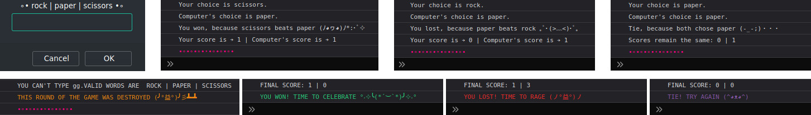

# The Odin Project Web Development 101
## Project: Rock Paper Scissors
Simple implementation of Rock Paper Scissors game from The Odin Project [curriculum](https://www.theodinproject.com/paths/foundations/courses/foundations/lessons/rock-paper-scissors).

This is my first **HTML/CSS/JS** project. **Live version** of the game is [here](https://mooniidev.github.io/rock-paper-scissors-game/).
### First stage | Game in the browser console
**The benefits I got from this stage:**
* Deepened knowledge of how **functions work** with each other.
* Learned how to color the **console text**.
* Enjoyed stylizing the **prompt** and **console texts**.

### Second stage | Game with added UI
**The benefits I got from this stage:**
* Learned to use and modify **[Font Awesome Icons](https://fontawesome.com/)**.
* Deepened knowledge of **CSS transform** and **transition** effects.
* Installed and learned to use **ESlint** for code problems fixing.
* Learned basic **manipulations of elements styles** through JavaScript code (setting attributes, adding/removing classes, changing inline styles and texts).
* Improved my **understanding of JavaScript functions** (organization, workspaces, scopes, calling, invoking, breaking down into smaller ones..).

### Summary
* For a more playful experience, **theme was changed** to *'Fantasy'* and **name was changed** to *'Wand Bow Mace'*.
* The game has a **responsive layout** with one breakpoint.
* The game is **fully playable** in the browser window.
* I really tried to keep **readable and understandable code**, **short functions**, **descriptive names** and **fantasy mood** of the game.✨
